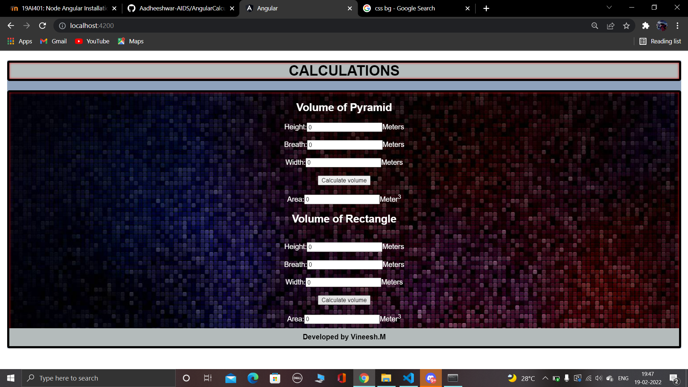

# AngularCalculation

# Web Page for Mathematical Calculations using Angular

## AIM:
To design a dynamic website to perform mathematical calculations using Angular Framwork

## DESIGN STEPS:

### Step 1:

Requirement collection.

### Step 2:

Creating the layout using HTML and CSS in component.html file

### Step 3:

Write typescript to perform the calculations.

### Step 4:

Validate the layout in various browsers.

### Step 5:

Validate the HTML code.

### Step 6:

Publish the website in the given URL.

## PROGRAM :
### app.component.html:
```
<style>
  *{
      box-sizing:border-box;
      font-family: Arial, Helvetica, sans-serif;
  }
  body{
      background-color:rgb(142, 161, 187);
  }
  .container {
    width: auto;
    margin-left: auto;
    margin-right: auto;
    background-image: url(https://i.stack.imgur.com/NEuip.jpg");
    box-shadow: inset 0 0 5px #ee1212; 
    backdrop-filter: blur(15px);
    border-radius: 5px;
    border: 5px solid #000000;
  }

  .content2{
    display: block;
    text-align: center;
    color: rgb(0, 0, 0);
    padding-bottom: 10px;
  }

  .content{
    display: block;
    text-align: center;
    color:rgb(0, 0, 0);
  }

  h1{
      display: block;
      text-align: center;
      width: auto;
      margin-left: auto;
      margin-right: auto;
      background-color: rgb(180, 187, 187);
      box-shadow: inset 0 0 5px #e60909; 
      backdrop-filter: blur(15px);
      border-radius: 5px;
      border: 5px solid #070101;

  }
 

  .footer{
      display: block;
      width: 100%;
      height: 40px;
      background-color:rgb(180, 187, 187);
      text-align: center;
      padding-top: 10px;
      margin: 0px 0px 0px 0px;
      color: #000000;
  }
</style>

<body>
  <h1><b>CALCULATIONS</b></h1>
  <div class="container">
      <div class="content">
          <h2>Volume of Pyramid</h2>
          <pyramid-Volume></pyramid-Volume>
      </div>
      <div class="content2">
          <h2>Volume of Rectangle</h2>
          <rectanglevolume></rectanglevolume>
      </div>
      <div class="footer"><b>Developed by Aadheeshwar.A</b></div>
  </div>
</body>
```
### app.module.ts:
```
import { NgModule } from '@angular/core';
import { FormsModule } from '@angular/forms';
import { BrowserModule } from '@angular/platform-browser';


import { AppComponent } from './app.component';
import { pyramidcomponent } from './pyramid.component';
import { rectanglecomponent } from './rectangle.component';

@NgModule({
  declarations: [
    AppComponent,pyramidcomponent,rectanglecomponent
  ],
  imports: [
    BrowserModule,FormsModule
  ],
  providers: [],
  bootstrap: [AppComponent]
})
export class AppModule { }
```
### pyramid.component.html:
```
<div>
    Height:<input type="text" [(ngModel)]="height">Meters<br/>
    <br/>
    Breath:<input type="text" [(ngModel)]="breadth">Meters<br/>
    <br/>
    Width:<input type="text" [(ngModel)]="width">Meters<br/>
    <br/>
    <input type = "button" (click)="oncalculatevolume()" value="Calculate volume"><br/>
    <br/>
    Area:<input type="text" readonly value="0" [value]="volume">Meter<sup>3</sup>

</div>
```
### pyramid.component.html:
```
import { Component } from "@angular/core";

@Component({
    selector:'pyramid-Volume',
    templateUrl:'pyramid.component.html'
})
export class pyramidcomponent{
    height:number;
    breadth:number;
    width:number;
    volume:number;
    constructor(){
        this.height = 0
        this.breadth = 0
        this.width = 0

        this.volume = this.height*this.breadth*this.width;
    }

    oncalculatevolume(){

        this.volume = this.height*this.breadth*this.width;
    }
}
```
### rectangle.component.html:
```
<div>
    <br/>
    Height:<input type="text" [(ngModel)]="height1">Meters<br/>
    <br/>
    Breath:<input type="text" [(ngModel)]="breadth1">Meters<br/>
    <br/>
    Width:<input type="text" [(ngModel)]="width1">Meters<br/>
    <br/>
    <input type = "button" (click)="oncalculatevolume()" value="Calculate volume"><br/>
    <br/>
    Area:<input type="text" readonly value="0" [value]="volume1">Meter<sup>3</sup>
    <br/>

</div>
```
### rectangle.component.ts:
```
import { Component } from "@angular/core";

@Component({
    selector: 'rectanglevolume',
    templateUrl: 'rectangle.component.html'

})

export class rectanglecomponent{
    height1:number;
    breadth1:number;
    width1:number;
    volume1:number;
    constructor(){
        this.height1 = 0
        this.breadth1 = 0
        this.width1 = 0

        this.volume1 = (this.height1*this.breadth1*this.width1)/3;
    }

    oncalculatevolume(){

        this.volume1 = (this.height1*this.breadth1*this.width1)/3;
    }
}
```
## OUTPUT:

### Before calculation:


### After calculation:

## Result:
Thus a Mathmetical Calculation website is created using Angular.
